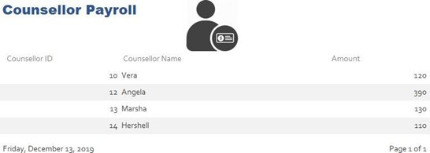
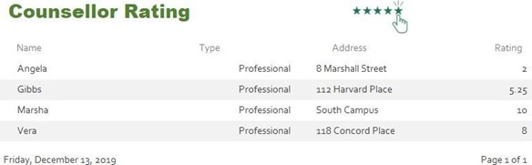
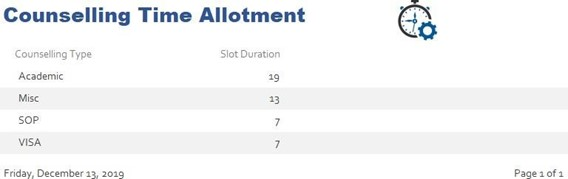

# Abstract: 
 
 

We created this project to enhance the student and counselor experience by connecting them on a common CRM portal counselors counsel students. While making the database system when a counselor counsels a student the counselor is not available to other students as he is busy. The Database model is time and money efficient as auto assigns universities to students based on their academic profiles and computes counselors payrolls   
## Business Goals:
1.Which Counsellors earn the most?

2.How does every counselor fare in their services (Feedback)

3.Which form of counseling is the sought after 

4.Which countries are hotbeds for which subjects

 
5.How content are students with the service being provided   

## Technologies: MS SQL,T-SQL,PL/SQL,MS Acess,MS Visio ,relational data models, entity-relationship modeling 

## Goals achieved: 
1. Fundamental data and database concepts
2. Created databases and database objects using popular database management system products
3. Developing ER and Data Models from a problem statement 
4. Learnt to solve problems by constructing database queries using Structured Query Language (SQL)
5. Design databases using data modeling and data normalization techniques
6. Develop insights into future data management tool and technique trends

## Problem at hand 
As of now India does not have any system in place that helps students with a centralized experience. 
Many students pursuing masters must go through an arduous process of paying hefty fees to commercialized counselors The student must go through many hassles and mundane loads like getting a recommendation from multiple teachers without having any prior knowledge of which teachers’ recommendation would boost their profile the most.  
Counseling companies have multiple students under their supervision and are all governed by a manager. 
Thus, catering to every student‘s doubts and giving every student his respective university list becomes a hassle due to time constraints as there are many factors to be taken into consideration. 
Students must book appointments 2-3 weeks prior to which their process is stalled thus making it cumbersome for the student to carry on with their formalities. 
Thus, I plan on making a database that enhances the student experience.  The solution I propose plans to make the student experience hassle-free by centralizing the experience gathering counselors and students online on a single portal.  Many Counsellors and students alike who have pursued their education abroad have prior knowledge of how the formalities and system fall into place. 
By centralizing many key drawbacks can be curbed and the entire process can be enhanced and expedited

